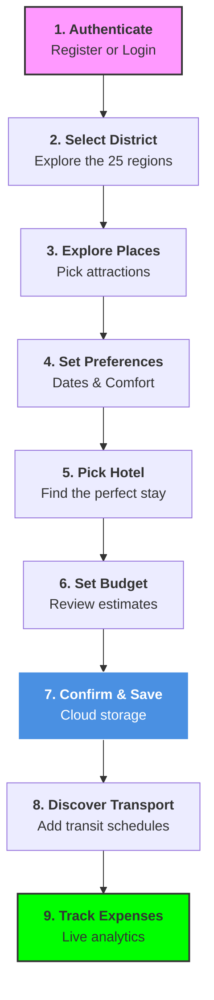

<div align="center">

# ✈️ TravelGenie

### Comprehensive Travel Planning Platform for Sri Lanka

[](https://mongodb.com/)
[](https://expressjs.com/)
[](https://reactnative.dev/)
[](https://expo.dev/)
[](LICENSE)

TravelGenie helps users plan multi-day trips across Sri Lanka — select a district, explore places on an interactive map, choose accommodation, plan a budget, and track expenses in one seamless workflow.

🔥 **Multi-Role Support**: Switch between 🌍 **Guest Mode** (browse destinations without an account), 🎒 **User Mode** (full trip planning), and 👑 **Admin Mode** (advanced dashboard and moderation rights).

[📖 Backend Docs](Backend/README.md) · [📱 Mobile Docs](mobile/README.md)

</div>

---

## 👥 Team Members & Responsibilities

| # | Registration | Feature |
|---|---|---|
| 01 | IT24100853 | Transportation & Transit Management |
| 02 | IT24100858 | Destination Management |
| 03 | IT23361690 | Trip Itinerary Management |
| 04 | IT24100533 | Hotel and Accommodation Management |
| 05 | IT24101021 | Expenses Management |
| 06 | IT24101927 | Feedback and Review System Management |

---

## ✨ Features

<details>
<summary><strong>01 · Transportation & Transit Management</strong> <em>(IT24100853)</em></summary>
<br>

- **Public Schedule Discovery**: District-aware board for browsing express buses, intercity trains, domestic flights, and ferries.
- **Intelligent Search Engine**: Multi-dimensional filtering by route, mode of transport, and provider.
- **Popularity-Driven Insights**: Real-time ranking of transit routes based on weighted demand scores.
- **Admin Fleet Management**: Specialized dashboard for schedule CRUD and operational metadata management.

</details>

<details>
<summary><strong>02 · Destination Management</strong> <em>(IT24100858)</em></summary>
<br>

- **Interactive Maps**: Full CRUD for destinations with GeoJSON-based location management.
- **Content Filtering**: Personalized suggestions driven by user interests (Nature, Culture, Adventure).
- **Attraction Ranking**: Context-aware ranking based on similarity scores and categories.

</details>

<details>
<summary><strong>03 · Trip Itinerary Management</strong> <em>(IT23361690)</em></summary>
<br>

- **6-Step Linear Trip Planner**: Orchestrating a smooth 6-step flow: District → Places → Preferences → Hotels → Budget → Finalize.
- **Post-planning workflow**: Once saved, discover transit schedules (Bus/Train/Flight) and track real-time expenses.
- **State Persistence**: Global state management for session-resilient planning.

</details>

<details>
<summary><strong>04 · Hotel and Accommodation Management</strong> <em>(IT24100533)</em></summary>
<br>

- **Premium Interface**: Map-to-list synchronization with live pins and auto-scrolling cards.
- **Advanced Filtering**: Ranked by budget, preferences, ratings, and proximity.
- **Multi-Currency Support**: Dynamic pricing in LKR, USD, and EUR.

</details>

<details>
<summary><strong>05 · Expenses Management</strong> <em>(IT24101021)</em></summary>
<br>

- **Financial Intelligence**: Real-time spending health tracking and visual budget-vs-actual analytics.
- **Market Price Database**: Benchmarks for Hotels, Transport, and Activities across districts.
- **Trend Forecasting**: Price predictions based on historical market data.

</details>

<details>
<summary><strong>06 · Feedback and Review System Management</strong> <em>(IT24101927)</em></summary>
<br>

- **Unified Review Engine**: Real-time synchronization of ratings across Places and Hotels.
- **Moderation Workflow**: Secure "Report-to-Hide" strategy with admin governance.
- **Social Interaction**: Helpful voting, recommendation badges, and context categorization.

</details>

---

## 🏗️ System Architecture

```
┌──────────────────────────────────────────────────┐
│                 React Native App                 │
│              Expo · React Navigation             │
│                    Port 8081                     │
└─────────────────────┬────────────────────────────┘
                      │  REST API  ·  JWT Auth
┌─────────────────────▼────────────────────────────┐
│                Express Backend                   │
│       Node.js · Mongoose ODM · Multer            │
│                   Port 5000                      │
└─────────────────────┬────────────────────────────┘
                      │
┌─────────────────────▼────────────────────────────┐
│               MongoDB Database                   │
│          travelgenie  ·  collections             │
└──────────────────────────────────────────────────┘
```

---

## 🗺️ Trip Planning Workflow



---

## 🗄️ Database

Data models managed by Mongoose:

| Category | Collections |
|---|---|
| 👤 **Users** | `users` |
| 🗺️ **Geography** | `districts`, `places` |
| 🚌 **Transport** | `transports`, `transportschedules` |
| 🏨 **Hotels** | `hotels` |
| 🧳 **Trips & Budget** | `trips`, `expenses` |
| ⭐ **Reviews** | `reviews` |
| 🔔 **Notifications** | `notifications` |

---

## 📁 Repository Structure

```
Travelgenie/
├── docs/                   # Architecture, API, deployment, and testing notes
├── Backend/                # Express API & MongoDB Logic
│   └── src/
│       ├── config/         # Database & Env config
│       ├── middleware/     # Auth, Uploads, Errors
│       ├── modules/        # Module-specific logic (Hotels, Trips, etc.)
│       ├── routes/         # Central route register
│       ├── utils/          # Standardized responses & helpers
│       └── server.js       # Entry point
└── mobile/                 # React Native / Expo Mobile App
    └── src/
        ├── components/     # Atomic UI elements
        ├── constants/      # Theme & API config
        ├── context/        # Global state (Auth, Planner)
        ├── navigation/     # App routing logic
        ├── screens/        # Main page components
        └── utils/          # Formatters & Helpers
```

---

## 🚀 Quick Start

### 1 — Backend
```bash
cd Backend
npm install
```

Create a **`.env`** file in `Backend/`:
```env
NODE_ENV=development
PORT=5000
MONGO_URI=mongodb://localhost:27017/travelgenie
JWT_SECRET=your_jwt_secret
JWT_EXPIRES_IN=7d
CORS_ORIGINS=*
```

Run the server:
```bash
npm run dev   # → http://localhost:5000
```

**Seed the database (Recommended for first run):**
```bash
npm run db:seed-all        # Consolidated seed: Districts, Places, Hotels, Tags
npm run db:seed-transports # Seeds 10,000+ transport schedules
npm run db:seed-admin      # Creates the initial admin account
npm run db:seed-expenses   # Seeds market price records and trends
```

### 2 — Mobile App
```bash
cd mobile
npm install
```

Create a **`.env`** file in `mobile/`:
```env
EXPO_PUBLIC_API_BASE_URL=http://<YOUR_LAN_IP>:5000/api/v1
```
*Note: For Android Emulator, the default fallback is `http://10.0.2.2:5000/api/v1`.*

Start Metro:
```bash
npm start
```

---

## 🛠️ Tech Stack

| Layer | Technology |
|---|---|
| **Runtime** | Node.js + Express.js |
| **ODM / DB** | Mongoose + MongoDB Atlas |
| **Auth** | JWT (JSON Web Tokens) + bcryptjs |
| **Frontend** | React Native (Expo SDK 54) |
| **Maps** | React Native Maps (GeoJSON) |
| **Icons** | Lucide React Native / Expo Vector Icons |

---

## 🔌 Port Reference

| Service | URL |
|---|---|
| **Backend API** | `http://localhost:5000` |
| **Mobile Metro** | `http://localhost:8081` |

---

Built with ❤️ for Sri Lanka 🇱🇰
